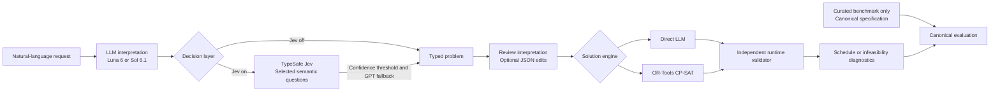
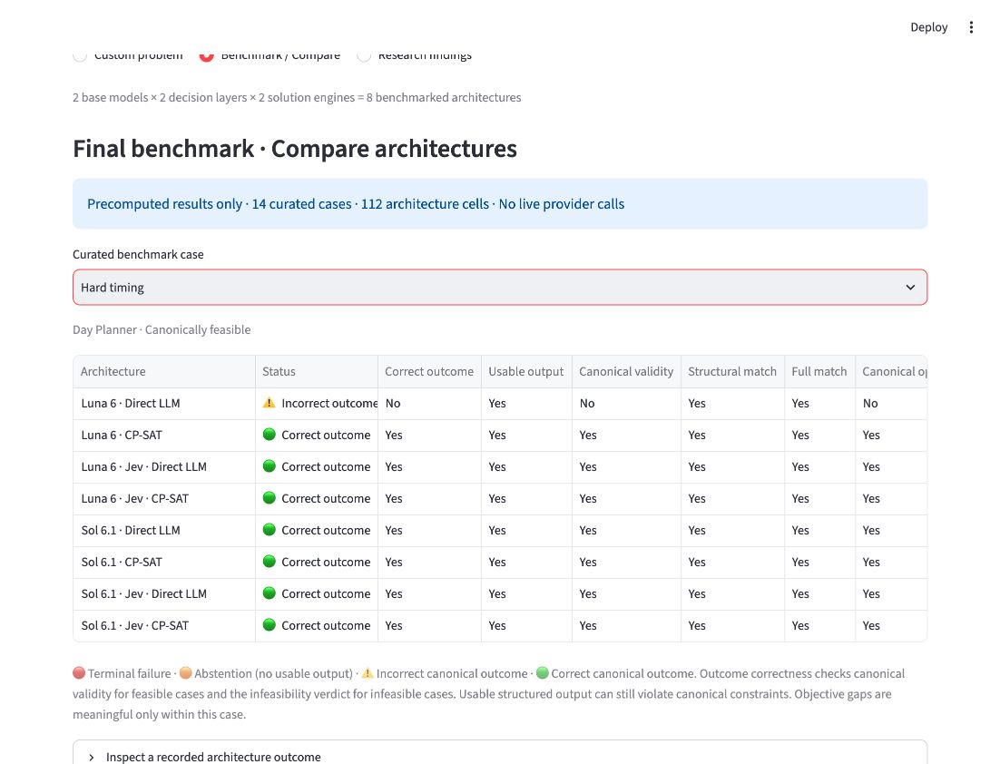

# AI Decision Optimizer

**AI Decision Optimizer is an interactive research platform for evaluating AI decision-making architectures on constrained scheduling problems.**

How do the **base language model**, **semantic decision layer**, and **deterministic optimization engine** affect correctness, quality, cost, and latency on constrained scheduling tasks?

This Research MVP combines a working scheduling demo with a completed, curated project benchmark: **14 cases × 8 architectures = 112 cells**. It makes interpretation, semantic edits, solver output, and independent validation inspectable. The results are descriptive observations, not a general benchmark of model intelligence.

[Interactive demo](https://ai-decision-optimizer.streamlit.app/) · [Final analysis](benchmark_results/final_sol61_v2/analysis/analysis_report.md) · [Evaluation methodology](docs/benchmark_methodology.md)

Python · OpenAI Structured Outputs · TypeSafe Jev · Pydantic · OR-Tools CP-SAT · Streamlit · pytest · uv

## Architecture

| Dimension | Options | Responsibility |
| --- | --- | --- |
| Base model | GPT-6 Luna (`gpt-6-luna`) / GPT-6.1 Sol (`gpt-6.1-sol`) | Interpret the request as typed scheduling JSON |
| Decision layer | Jev off / Jev on | Optionally review selected semantic decisions |
| Solution engine | Direct LLM / OR-Tools CP-SAT | Produce the schedule from the same typed formulation |

**2 × 2 × 2 = 8 architectures.** Independent validation is evaluation infrastructure shared by every architecture.



The interactive app defaults to **Sol 6.1 + CP-SAT**, with Jev on when the TypeSafe key is configured. Direct LLM solves typed JSON rather than raw natural language. CP-SAT optimality applies to the represented problem; canonical benchmark evaluation separately checks what the original case required.

## Domains

- **Day Planner:** active/passive activities, fixed events, required/optional tasks, timing bounds, precedence and immediate handoffs, soft timing preferences, and work interruptions.
- **Workforce Scheduler:** dated shifts, staffing coverage, employee eligibility and availability, maximum hours, rest and consecutive-day rules, shift preferences, and workload fairness.

Both domains retain readable interpretations, editable typed JSON, schedule/assignment tables, independent validation, and bounded infeasibility diagnostics. The supported constraint set is deliberately finite.

## How Jev is used

Jev reviews questions generated from the LLM's extracted content. It does not independently reconstruct the request, discover omitted entities, or generate the full problem or schedule.

| Implemented question type | Primitive | Represented decision |
| --- | --- | --- |
| Constraint hardness | Choice | Firm timing requirement or soft preference |
| Task requirement | Choice | Required or optional activity |
| Task mode | Choice | Active or passive activity |
| Preference weight | Score | Preference strength, weights 1–5 |
| Availability applicability | Noul | Whether an employee's statement applies to a shift |

The selected-answer probability must reach `JEV_APPLY_THRESHOLD` (default **0.7**) before an answer is applied; otherwise the GPT interpretation is retained. Score selects the modal level (lowest level on ties), maps SDK levels 0–4 to weights 1–5, and records the expected score separately. Workforce availability questions cover only employees flagged by extraction as having availability/preference statements.

The UI shows GPT baseline, Jev proposal, selected probability, application decision, final represented value, and whether the formulation changed. Full probability distributions are expandable. Manual JSON edits occur after this review and may supersede represented values.

## Experimental methodology

The final benchmark contains **nine Day Planner and five Workforce cases**, including two templated/generated Workforce cases. Twelve canonical problems are feasible and two infeasible.

- One extraction sample per case/model is shared across four architecture variants. The two Jev-on engines also share an adjusted formulation. The 112 cells are not independent samples.
- Curated canonical specifications and name alignment support independent evaluation. Feasible outcome correctness means canonical validity; infeasible outcome correctness means the correct infeasibility verdict. Usable structured output can still be canonically invalid.
- An immutable **raw → offline reconciled → deterministic analysis** pipeline preserves observed failures and records corrections/provenance. Nine terminal failures and eight abstentions stay in denominators.
- **125 primary decision labels:** 54 human-reviewed and 71 generator-derived. Three subjective preference-weight labels are excluded from primary exact-answer accuracy and calibration.
- Decision accuracy counts each extraction once, across **250 model-label opportunities**, rather than duplicating it per engine. Missing questions count wrong in end-to-end accuracy.

There are no repeated-run variance estimates, significance claims, or composite rankings. Objectives and gaps are compared within cases, never averaged across incompatible scheduling objectives. [Full methodology](docs/benchmark_methodology.md) and the [reconciliation manifest](benchmark_results/final_sol61_v2/reconciliation_manifest.json) document the boundaries.

## Results

All counts below come from the committed [Phase 10 architecture summary](benchmark_results/final_sol61_v2/analysis/architecture_summary.csv).

| Architecture | Correct outcome | Usable | Canonical valid, feasible | Structural match | Full match | Optimum / valid feasible | Failures / abstentions | Median s | Median OpenAI cost |
| --- | ---: | ---: | ---: | ---: | ---: | ---: | ---: | ---: | ---: |
| Luna 6 · Direct LLM | 8/14 | 11/14 | 7/12 | 9/14 | 9/14 | 6/7 | 2 / 1 | 8.140 | $0.0004465 |
| Luna 6 · CP-SAT | 11/14 | 11/14 | 10/12 | 9/14 | 9/14 | 10/10 | 2 / 1 | 4.938 | $0.0003491 |
| Luna 6 · Jev · Direct LLM | 9/14 | 10/14 | 8/12 | 7/14 | 7/14 | 6/8 | 3 / 1 | 10.125 | $0.0004623 |
| Luna 6 · Jev · CP-SAT | 11/14 | 11/14 | 10/12 | 7/14 | 7/14 | 10/10 | 2 / 1 | 5.056 | $0.0003491 |
| Sol 6.1 · Direct LLM | 13/14 | 13/14 | 11/12 | 12/14 | 11/14 | 11/11 | 0 / 1 | 11.589 | $0.0075180 |
| Sol 6.1 · CP-SAT | 13/14 | 13/14 | 11/12 | 12/14 | 11/14 | 11/11 | 0 / 1 | 7.697 | $0.0052360 |
| Sol 6.1 · Jev · Direct LLM | 13/14 | 13/14 | 11/12 | 10/14 | 9/14 | 11/11 | 0 / 1 | 11.823 | $0.0074480 |
| Sol 6.1 · Jev · CP-SAT | 13/14 | 13/14 | 11/12 | 10/14 | 9/14 | 11/11 | 0 / 1 | 7.952 | $0.0052360 |

Correct outcome, usable output, and formulation match retain all 14 cases. Canonical feasible validity uses the 12 feasible cases; optimum attainment uses only each architecture's valid feasible outputs. Each Sol architecture correctly reports both infeasible cases (2/2); each Luna architecture reports one (1/2).

Latency and cost are **standalone architecture estimates** under shared extraction, not a sum of separately billed eight-arm executions. Costs reflect known OpenAI token usage, exclude TypeSafe charges, and omit unknown timeout billing. The two Luna architectures without Jev each contain one cell with unknown usage; Luna + Jev + Direct contains two, and Luna + Jev + CP-SAT contains one. Sol cells have no unknown usage. [Recorded experimental accounting](benchmark_results/final_sol61_v2/analysis/analysis_summary.json) is separate from these isolation estimates.

The central descriptive findings:

1. **Sol 6.1 was more robust in this benchmark:** 52/56 correct cells versus Luna's 39/56, with typed extraction coverage of 13/14 versus 11/14.
2. **CP-SAT improved weaker-Luna outcomes:** across 56 matched engine pairs, Direct recorded 43 correct outcomes and CP-SAT 48. CP-SAT improved five pairs and worsened zero; all five improvements involved Luna. Every valid feasible CP-SAT output attained the canonical optimum (**42/42**), compared with Direct's 34/37.
3. **Sol 6.1 Direct and CP-SAT tied on correctness and optimum attainment:** each engine recorded 26/28 correct Sol outcomes and 22/22 optima among valid feasible Sol outputs.
4. **Jev's semantic edits did not improve case-level outcomes:** eight genuine formulation changes reduced structural correctness; none fixed a benchmark outcome. Across all Jev pairs there were two improvements and one worsening without formulation changes, reflecting independent Direct solve variation rather than benefits from semantic edits.
5. **Extraction coverage was an end-to-end bottleneck:** 223/250 eligible model-label opportunities aligned to observed decisions; 27 were missing because of extraction/coverage. GPT baseline was 223/223 correct among aligned questions, raw Jev proposals 208/223, and thresholded/final represented answers 216/223. Raw errors were confined to availability questions. Threshold fallback retained eight correct GPT answers that raw Jev would have replaced incorrectly.

This is a useful **negative/null Jev result**. Generated Workforce availability labels dominate pooled decision counts; per-type results in the [final analysis](benchmark_results/final_sol61_v2/analysis/analysis_report.md) provide essential context. These observations do not establish a universal winner.

## Calibration


| Primitive / group | Brier definition | Observations | Brier |
| --- | --- | ---: | ---: |
| Pooled Choice | Binary squared error, range 0–1 | 63 | 0.005284 |
| Availability / Noul | Binary squared error of yes probability, range 0–1 | 150 | 0.075577 |
| Preference weight / Score | Sum over five classes, range 0–2 | 10 | 0.291500 |

The reliability diagram compares selected confidence with empirical exact correctness in five bins. **Preference-weight n=10 is a small sample**, insufficient for broad calibration claims. The five-class Brier definition is incompatible with the binary definition; these metrics remain separate and are never pooled into a single score. [Metric definitions and per-type values](benchmark_results/final_sol61_v2/analysis/calibration_metrics.json) are committed.

## Interactive demo

[Launch the Streamlit app](https://ai-decision-optimizer.streamlit.app/).



The Compare view shows committed outcomes for one curated case. The Results section explains aggregate counts and why individual Direct solve differences do not establish a Jev benefit.

- **Custom problem:** select a domain and one architecture; interpret natural language, inspect Jev decisions if enabled, review/edit JSON, then confirm and solve. The result header shows runtime validation, objective, proven optimality when known, pipeline latency, estimated OpenAI cost, model calls, and Jev question/call counts. Custom prompts have no canonical answer and receive no canonical benchmark scores.
- **Benchmark / Compare:** select any of the 14 curated cases and inspect its eight recorded outcomes, plus the aggregate architecture table. Terminal failures, abstentions, and canonically incorrect outputs are distinct. This mode reads only committed final artifacts and never launches live architecture runs.
- **Research findings:** read finalized model, engine, Jev, and primitive-specific calibration findings.

Keys are configured server-side. Jev is disabled with an explanation when `TYPESAFE_API_KEY` is missing; Compare and Research findings require no API keys. Custom runs execute only the architecture explicitly selected.

Earlier screenshots (`day-planner.png`, `workforce-scheduler.png`, and `infeasibility.png`) remain in `docs/images/` as historical development artifacts. Earlier MVP/Sol 6 and pilot results are not current Sol 6.1 benchmark evidence. Capture updated screenshots of the architecture controls, Jev decision panel, and precomputed Compare view after deployment; calibration above is the finalized research figure.

## Validation and engineering

The deterministic suite passed **290 tests before this UI/README pass**. The final suite passes **321 tests**, without paid provider calls.

Engineering includes typed extraction boundaries, independent validators, stale-result invalidation, resumable paired benchmark execution, immutable raw artifacts, deterministic offline reconciliation and Phase 10 analysis, and API failure/timeout handling. Focused UI tests check offline mode isolation, all architecture labels, exact committed summaries, runtime decision records, configuration fallback, and custom-versus-canonical scoring boundaries.

```bash
uv run pytest
```

## Limitations

- Fourteen curated cases and one extraction sample per case/model; no statistical-significance claims or repeated-run variance estimates.
- Shared extraction across variants limits independence; both Jev-on engines share the same semantic review.
- Benchmark-aware prompt development and two templated/generated Workforce cases limit generalization.
- Direct LLM solves typed JSON, not raw natural language. Jev reviews only extracted content and cannot recover omitted entities or failed extractions.
- Custom prompts lack canonical ground truth. Runtime validation establishes compliance with the interpreted problem, not fidelity to the original intent.
- Three subjective preference-weight labels are excluded; only ten eligible Score observations support the calibration estimate.
- Standalone cost/latency estimates include shared stages; unknown timeout billing and TypeSafe costs are not assigned.
- Both domains use a closed constraint set and same-day intervals. The app supports one clarification round. Infeasibility diagnostics use bounded checks rather than formal minimal-unsatisfiable-core proofs.

## Running locally

From the repository directory:

```bash
cp .env.example .env
uv sync --extra test
uv run streamlit run app.py
```

Set `OPENAI_API_KEY` in `.env` for custom natural-language interpretation and Direct LLM solving. Set `TYPESAFE_API_KEY` to enable Jev. Never commit real keys. `.env` is gitignored and loads automatically; no shell export is required. `TYPESAFE_MODEL=jev-latest` and `JEV_APPLY_THRESHOLD=0.7` are the existing defaults. The UI explicitly selects Luna or Sol 6.1, with Sol as its default.

For Streamlit Community Cloud, add root-level `OPENAI_API_KEY` and optional `TYPESAFE_API_KEY` in the app's **Secrets** settings; root-level secrets are available to the existing environment-based configuration. Optionally set `TYPESAFE_MODEL` and `JEV_APPLY_THRESHOLD`. No secrets are displayed in the UI. Deploy/reboot the existing `app.py` application after pushing these changes, then inspect offline Compare and the configuration defaults. No database or new dependency is required.

## Research artifacts

- [Reconciled final observations](benchmark_results/final_sol61_v2/reconciled.jsonl)
- [Reconciliation manifest](benchmark_results/final_sol61_v2/reconciliation_manifest.json)
- [Phase 10 analysis report](benchmark_results/final_sol61_v2/analysis/analysis_report.md)
- [Machine-readable summary and provenance](benchmark_results/final_sol61_v2/analysis/analysis_summary.json)
- [Project plan and stop gate](project_plan.md)

The final benchmark and analysis are complete. This presentation pass does not rerun observations, revise labels, or expand the experiment.
