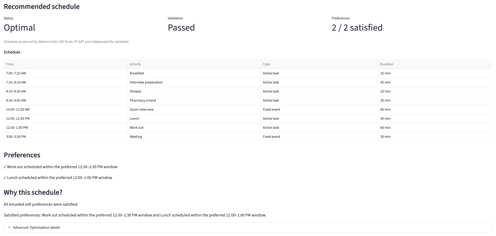
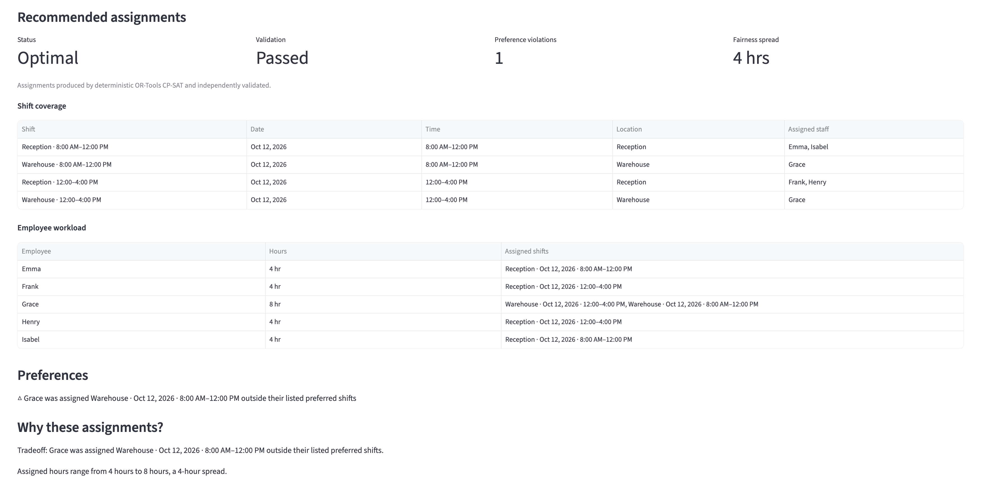
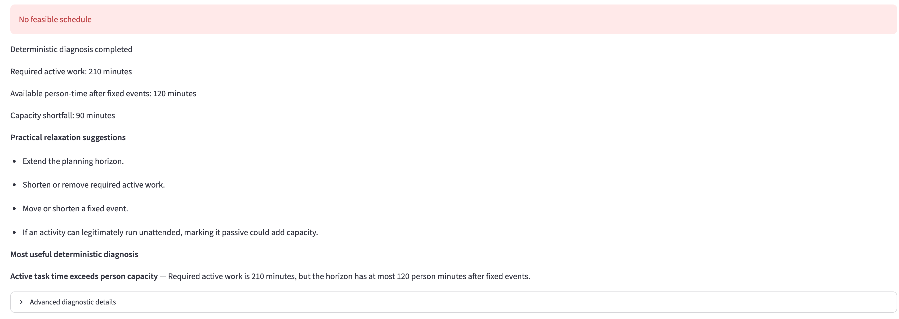

# AI Decision Optimizer

Turn natural-language planning problems into validated, optimized recommendations using LLM-based interpretation and deterministic mathematical optimization.

> **The LLM interprets the problem; OR-Tools chooses the solution.**

Python · GPT-6.1 Sol · OpenAI Structured Outputs · Pydantic · OR-Tools CP-SAT · Streamlit · pytest · uv

[Live Demo](https://ai-decision-optimizer.streamlit.app/) · [GitHub Repository](https://github.com/andrewcukierwar/ai-decision-optimizer)



## Live demo

The public Streamlit demo is available here: [Launch AI Decision Optimizer](https://ai-decision-optimizer.streamlit.app/).

Deployment secrets are configured server-side, so visitors do not need to provide their own OpenAI API key.

## Why this exists

Planning requests are usually expressed in language: goals, deadlines, fixed events, preferences, and exceptions. LLMs are useful for turning that messy input into a structured problem. They are not the right component to guarantee that every hard constraint is satisfied or that the resulting plan is optimal.

AI Decision Optimizer separates those responsibilities:

- language understanding happens at a typed extraction boundary;
- deterministic code compiles the confirmed formulation into a mathematical model;
- OR-Tools CP-SAT determines feasibility and optimized assignments;
- an independent validator checks the materialized result against the confirmed schema;
- the application presents the schedule, diagnostics, and explanation from structured facts.

The result is a small, inspectable pipeline for decision support rather than a language model that simply proposes a plausible-looking schedule.

## Architecture

```mermaid
flowchart LR
    U[User request] --> E

    subgraph LLM["LLM interpretation"]
        E[GPT-6.1 Sol<br/>OpenAI Structured Outputs] --> X{Complete extraction?}
        X -- No --> C[One clarification round]
        C --> E
        X -- Yes --> P[Typed Pydantic<br/>problem schema]
    end

    P --> I[Human-readable interpretation]
    I --> K[User confirms<br/>or edits structured JSON]

    subgraph DET["Deterministic optimization and validation"]
        K --> COMP[Deterministic compiler]
        COMP --> CP[OR-Tools CP-SAT]
        CP --> R[Materialized result]
        R --> V[Independent plain-Python validator]
        V --> F{Feasible and valid?}
        F -- Yes --> G[Grounded result<br/>and explanation]
        F -- No --> D[Infeasibility diagnosis]
    end

    G --> S[Streamlit presentation]
    D --> S

    classDef llm fill:#eef6ff,stroke:#4776a8,color:#17324d;
    classDef deterministic fill:#eef8f0,stroke:#43865a,color:#173d24;
    classDef human fill:#fff7e6,stroke:#c4862b,color:#4d3512;
    class E,X,C,P llm;
    class COMP,CP,R,V,F,G,D deterministic;
    class U,I,K,S human;
```



- GPT-6.1 Sol performs semantic extraction into one of the typed problem schemas.
- CP-SAT determines feasibility and the optimized decisions; it does not receive a free-form request.
- The independent validator checks the materialized result against the confirmed schema and recomputes the relevant hard-constraint and objective semantics.
- Explanations use structured solver and validator facts. They do not claim formal verification or rely on hidden reasoning about what the optimizer “wanted.”

## Design decisions

1. **Separate interpretation from optimization.** GPT-6.1 Sol extracts structured intent; CP-SAT chooses the schedule.
2. **Use two concrete schemas.** `DayPlan` and `ShiftSchedule` keep the MVP bounded and testable instead of pretending to support arbitrary optimization problems.
3. **Validate independently of the compiler.** Materialized solver results are checked against the confirmed schema by separate plain-Python validators.
4. **Require user confirmation.** The parsed interpretation is visible and editable before it becomes an optimization problem.
5. **Treat infeasibility as a valid result.** The system can report that no schedule exists and provide deterministic diagnostic evidence instead of forcing a plausible answer.

## What it can solve

### Day Planner

The Day Planner models a single planning horizon with:

- a planning horizon and optional work window;
- fixed events such as meetings;
- required and optional tasks;
- active tasks that consume the person’s attention;
- passive tasks that can run while the person does other work when constraints allow;
- hard timing bounds such as earliest start and latest finish;
- precedence and process chains with minimum or maximum gaps, including immediate handoffs;
- soft `finish_before`, `preferred_window`, and work-interruption preferences;
- infeasibility diagnosis using deterministic evidence and bounded relaxation analysis.

Active tasks and fixed events share the person’s capacity. Passive tasks remain part of the timing and precedence model but do not consume that active-person resource.

### Workforce Scheduler

The Workforce Scheduler models dated shifts and employees with:

- shift start/end times, locations, and required staffing levels;
- employee maximum hours;
- location eligibility;
- unavailable shifts, time windows, and full days;
- preferred shifts as soft preferences;
- minimum rest, maximum consecutive days, and required days off;
- preference-violation penalties and workload fairness;
- infeasibility diagnosis using deterministic evidence and bounded relaxation analysis.

The MVP uses two concrete schemas with a deliberately closed rule set. It is not a general-purpose workforce scheduling DSL.



## Example workflow

### Natural-language request

> Plan my Saturday from 8:00 AM to 6:00 PM. I have an appointment from 10:30 to 11:00 AM. I need 30 minutes for groceries, and I need to do laundry: washing takes 30 minutes, transferring it takes 5 minutes, and drying takes 45 minutes. The washer and dryer can run unattended, but I need to be free for the transfer. I also want to work out for an hour and take 30 minutes for lunch. I’d prefer to get groceries done before lunch, work out in the early afternoon, and eat lunch sometime between noon and 1:00 PM.

### Interpreted formulation

The request becomes a typed `DayPlan` containing a fixed event, active and passive tasks, immediate process dependencies, hard timing facts, and soft preferences. A shortened view looks like this:

```json
{
  "horizon": {"start": "08:00", "end": "18:00"},
  "fixed_events": [
    {"name": "appointment", "start": "10:30", "end": "11:00"}
  ],
  "tasks": [
    {"name": "groceries", "duration_min": 30, "mode": "active"},
    {"name": "wash", "duration_min": 30, "mode": "passive"},
    {"name": "transfer", "duration_min": 5, "mode": "active"},
    {"name": "dry", "duration_min": 45, "mode": "passive"},
    {"name": "workout", "duration_min": 60, "mode": "active"},
    {"name": "lunch", "duration_min": 30, "mode": "active"}
  ],
  "precedences": [
    {"before": "wash", "after": "transfer", "max_gap_min": 0},
    {"before": "transfer", "after": "dry", "max_gap_min": 0}
  ],
  "preferences": [
    {"type": "finish_before", "task": "groceries", "time": "12:00", "weight": 1},
    {"type": "preferred_window", "task": "lunch", "start": "12:00", "end": "13:00", "weight": 1},
    {"type": "preferred_window", "task": "workout", "start": "12:00", "end": "15:00", "weight": 1}
  ]
}
```

### Optimized result

After confirmation, CP-SAT materializes task assignments while respecting hard constraints and minimizing the encoded preference penalties. The independent validator then checks the assignments and penalty calculations against the confirmed `DayPlan`. The Streamlit UI presents the schedule, preference outcomes, validation status, and a grounded explanation—or an infeasibility diagnosis when no hard-constraint-satisfying schedule exists.

## Reliability by design

### Typed structured extraction

The model must return one of the typed extraction schemas: `DayPlanExtraction` or `ShiftScheduleExtraction`. Pydantic validates the structured output, and the concrete `DayPlan` and `ShiftSchedule` schemas reject unsupported input fields.

### User-confirmed interpretation

The UI shows a readable interpretation before solving. Users can confirm it or edit the structured JSON; edited input is validated against the corresponding schema before it reaches the solver.

### Deterministic optimization

The compiler translates the confirmed schema into OR-Tools CP-SAT constraints and objective terms. CP-SAT determines feasibility and assignments with deterministic settings in the solver wrapper.

### Independent validation

A solver result is not treated as trustworthy merely because CP-SAT returned it. The materialized output is checked against the confirmed problem schema by separate plain-Python validators that do not import the compiler or inspect CP-SAT variables.

### Infeasibility handling

The system can return no feasible solution. For infeasible inputs, the application reports deterministic diagnostic findings and tests bounded relaxations such as timing bounds, fixed events, precedence, active-person capacity, eligibility, availability, hours, and supported hard rules where applicable. It does not force a schedule.



### Grounded explanations

Explanation text is rendered from structured assignments, objective values, preference penalties, workload facts, and validator results. It is not a free-form account of hidden solver reasoning.

Additional engineering safeguards include a no-API deterministic test path, rejection of unknown fields in edited structured input, invalidation of stale Streamlit results when the request or formulation changes, and environment-based secret handling (`.env` is ignored by Git).

## Evaluation

The following are curated MVP evaluation cases designed to exercise the supported scheduling semantics. They are not an industry benchmark, public benchmark, research benchmark, state-of-the-art claim, or claim of general natural-language optimization accuracy.

| Problem type | Formulations matched expected key fields | Formulation-valid cases solved successfully | Solved cases passed independent validation |
| --- | ---: | ---: | ---: |
| Day Planner | 13 / 13 | 11 / 11 | 11 / 11 |
| Workforce Scheduler | 3 / 3 | 2 / 2 | 2 / 2 |
| **Combined** | **16 / 16** | **13 / 13** | **13 / 13** |

These are historical pre-migration MVP results, not Sol 6.1 benchmark observations. They used the configured OpenAI model and API; the evaluation cases are curated to exercise the MVP’s supported semantics. The deterministic suite is separate and documented below.

## Eight-architecture benchmark pilot

The two active models are Luna 6 (`gpt-6-luna`) and Sol 6.1
(`gpt-6.1-sol`), crossed with Jev off/on and Direct LLM/CP-SAT. The 14-case
selection produces 112 cells. All paired arms share one extraction per
case/model; the Jev arms share one adjusted formulation.

```bash
uv run python scripts/run_benchmark.py --all-configurations --dry-run
uv run python scripts/label_jev_fixtures.py --baseline fixture
```

Live benchmark execution additionally requires `--allow-paid`. Pilot artifacts
use `benchmark_results/pilot_sol61_v2/`; reserve a fresh explicit
`--results-dir benchmark_results/final_sol61_v2` for the subsequent final run.
Do not reuse Sol 6 or pilot artifacts as final Sol 6.1 observations.

Completed invalid outputs and request timeouts are terminal, scored failures
and are skipped on resume. SDK retries are disabled. Transport failures are
separately visible and retryable on explicit resume. Feasible cases use binary
canonical validity; infeasible cases use correctness of the infeasibility
report with constraint counts and required completion marked N/A. Structural
formulation matching is primary; subjective weights are analyzed separately.

The draft answer key remains pending human review, including generator-derived
labels. Three subjective weight labels are excluded from primary exact-answer
accuracy/calibration until a rubric is agreed upon. Attach actual experimental
observations without creating a second sample:

```bash
uv run python scripts/label_jev_fixtures.py --baseline benchmark \
  --benchmark-results-dir benchmark_results/pilot_sol61_v2
```

See [benchmark methodology](docs/benchmark_methodology.md) for scoring,
probability gating, label provenance, cache fingerprints, and subsequent
analysis requirements. No paid benchmark results are claimed yet.

## Running locally

### Install

```bash
git clone https://github.com/andrewcukierwar/ai-decision-optimizer.git
cd ai-decision-optimizer
uv sync --extra test
```

### Configure the model API

```bash
cp .env.example .env
```

Edit `.env` and set `OPENAI_API_KEY`. The parser defaults to `gpt-6.1-sol`; set
`OPENAI_MODEL` to `gpt-6-luna` or `gpt-6.1-sol` to override it. The application
and evaluation scripts load `.env` automatically through
`decision_optimizer.config`; no manual shell export is required.

### Run the Streamlit app

```bash
uv run streamlit run app.py
```

The app provides both the Day Planner and Workforce Scheduler flows, with Luna
or Sol and CP-SAT or Direct LLM selectable. Each flow interprets the request,
supports one clarification round when required, shows the typed interpretation,
allows structured edits, and then confirms, solves, validates, and explains the
result.

## Testing

### Deterministic test suite

```bash
uv run pytest
```

Normal pytest requires no `OPENAI_API_KEY` and makes no paid OpenAI API calls.

### Live natural-language evaluation

These scripts make live OpenAI API calls and may incur API cost. Results can vary if a different model is configured. The checked-in cases are curated MVP evaluation cases, not a general benchmark.

```bash
uv run python scripts/evaluate_dayplan_nl.py
uv run python scripts/evaluate_shift_schedule_nl.py
```

Both scripts support `--model MODEL_NAME` to override `OPENAI_MODEL` for that
run. They load `.env` automatically. The checked-in fixtures live in
`tests/fixtures/`.

## Current limitations

- Day Planner is a same-day, minute-precision model; overnight intervals are not supported.
- Workforce shifts are also same-day; overnight shifts are not supported.
- The application supports one clarification round when the extracted formulation is incomplete.
- Natural-language interpretation still depends on model quality. User confirmation and optional structured editing are the safeguard before solving.
- Day Planner work-interruption cost counts active tasks that overlap the work window; it does not merge adjacent activities into interruption blocks.
- Infeasibility diagnostics use bounded deterministic checks and relaxation analysis, not formal minimal-unsatisfiable-core proofs.
- Workforce Scheduler supports a defined rule set rather than arbitrary user-authored constraints or a universal scheduling DSL.
- The workforce objective covers preference penalties and workload fairness; labor-cost optimization is not implemented.

## Roadmap

Future work from `project_plan.md` includes:

- additional optimization domains such as resource/budget allocation;
- calendar and travel-time integration;
- what-if and sensitivity analysis;
- a larger natural-language evaluation benchmark;
- experiments with Jev or another bounded decision layer.

## Project structure

```text
decision_optimizer/
├── dayplan/             # schema, compiler, solver, validator
├── shift_schedule/      # workforce schema, compiler, solver, validator
├── parsing/             # structured natural-language extraction
├── application.py       # orchestration
├── diagnostics.py       # deterministic infeasibility analysis
├── explanations.py      # grounded result/explanation facts
└── presentation.py      # user-facing formatting helpers

app.py                   # Streamlit application
scripts/                 # live NL evaluation scripts
tests/                   # deterministic regression suite
```
