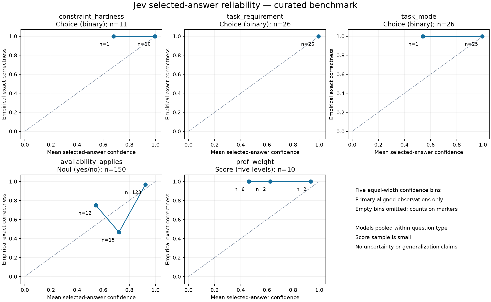

# Phase 10 — Final benchmark analysis

## 1. Dataset and execution

Offline analysis of `../reconciled.jsonl`, verified against the reconciliation manifest and finalized answer-key hash. 14 cases × two models × two Jev settings × two engines = 112 observations. Nine Day Planner and five Workforce cases; 12 canonically feasible and two infeasible. 103 execution successes include eight clarification/null-formulation outputs; nine terminal failures remain in all relevant denominators.

Outcome correctness: for feasible cases, `canonical_validation_valid == true`; for infeasible cases, `feasible_correctly_reported == true`. Usable output is `valid_output`; an invalid canonical schedule can still be usable structured output. Abstention means execution success without usable output and excludes terminal failures. Formulation accuracy counts every cell, including absent formulations as incorrect. Hard-constraint k/n is not a headline metric.

## 2. Eight architectures

| Architecture | Outcome | Usable | Terminal | Abstention | Valid feasible | Infeasible correct | Structural | Full | Optimal / valid feasible | % optimal |
| --- | --- | --- | --- | --- | --- | --- | --- | --- | --- | --- |
| Luna 6 · Direct LLM | 8 / 14 | 11 / 14 | 2 / 14 | 1 / 14 | 7 / 12 | 1 / 2 | 9 / 14 | 9 / 14 | 6 / 7 | 85.7% |
| Luna 6 · CP-SAT | 11 / 14 | 11 / 14 | 2 / 14 | 1 / 14 | 10 / 12 | 1 / 2 | 9 / 14 | 9 / 14 | 10 / 10 | 100.0% |
| Luna 6 · Jev · Direct LLM | 9 / 14 | 10 / 14 | 3 / 14 | 1 / 14 | 8 / 12 | 1 / 2 | 7 / 14 | 7 / 14 | 6 / 8 | 75.0% |
| Luna 6 · Jev · CP-SAT | 11 / 14 | 11 / 14 | 2 / 14 | 1 / 14 | 10 / 12 | 1 / 2 | 7 / 14 | 7 / 14 | 10 / 10 | 100.0% |
| Sol 6.1 · Direct LLM | 13 / 14 | 13 / 14 | 0 / 14 | 1 / 14 | 11 / 12 | 2 / 2 | 12 / 14 | 11 / 14 | 11 / 11 | 100.0% |
| Sol 6.1 · CP-SAT | 13 / 14 | 13 / 14 | 0 / 14 | 1 / 14 | 11 / 12 | 2 / 2 | 12 / 14 | 11 / 14 | 11 / 11 | 100.0% |
| Sol 6.1 · Jev · Direct LLM | 13 / 14 | 13 / 14 | 0 / 14 | 1 / 14 | 11 / 12 | 2 / 2 | 10 / 14 | 9 / 14 | 11 / 11 | 100.0% |
| Sol 6.1 · Jev · CP-SAT | 13 / 14 | 13 / 14 | 0 / 14 | 1 / 14 | 11 / 12 | 2 / 2 | 10 / 14 | 9 / 14 | 11 / 11 | 100.0% |

Objectives are evaluated under each case's canonical objective. `objective_gaps.csv` lists every cell, its domain, canonical optimum, objective and gap. Raw units are never averaged across problems. No relative normalization is used: zero optima are frequent, and cross-case objective scales are not comparable.

## 3. Luna 6 versus Sol 6.1

Before = Luna; after = Sol 6.1. These are paired descriptive observations, not independent model trials. Deltas are Sol minus Luna and include failed/abstained cells.

| Slice | Pairs | Outcome before → after | Outcome improved/worsened/same | Valid feasible before → after | Optimal before → after (valid denominators) | Objective improved/worsened/same/comparable | Median latency Δ s | Median cost Δ $ |
| --- | --- | --- | --- | --- | --- | --- | --- | --- |
| dayplan | 36 | 20 → 32 / 36 | 16/4/16 | 20 → 28 / 32 | 20/20 → 28/28 | 0/0/16/16 | 1.638 | 0.0055096 |
| shift_schedule | 20 | 19 → 20 / 20 | 1/0/19 | 15 → 16 / 16 | 12/15 → 16/16 | 3/0/12/15 | 4.376 | 0.0072332 |
| cp_sat | 28 | 22 → 26 / 28 | 6/2/20 | 20 → 22 / 24 | 20/20 → 22/22 | 0/0/18/18 | 2.258 | 0.0049102 |
| direct_llm | 28 | 17 → 26 / 28 | 11/2/15 | 15 → 22 / 24 | 12/15 → 22/22 | 3/0/10/13 | 3.287 | 0.0069648 |
| cp_sat/jev=false | 14 | 11 → 13 / 14 | 3/1/10 | 10 → 11 / 12 | 10/10 → 11/11 | 0/0/9/9 | 2.249 | 0.0049102 |
| cp_sat/jev=true | 14 | 11 → 13 / 14 | 3/1/10 | 10 → 11 / 12 | 10/10 → 11/11 | 0/0/9/9 | 2.302 | 0.0049102 |
| direct_llm/jev=false | 14 | 8 → 13 / 14 | 6/1/7 | 7 → 11 / 12 | 6/7 → 11/11 | 1/0/5/6 | 4.683 | 0.0070396 |
| direct_llm/jev=true | 14 | 9 → 13 / 14 | 5/1/8 | 8 → 11 / 12 | 6/8 → 11/11 | 2/0/5/7 | 2.900 | 0.0069648 |
| false | 28 | 19 → 26 / 28 | 9/2/17 | 17 → 22 / 24 | 16/17 → 22/22 | 1/0/14/15 | 3.323 | 0.0061514 |
| true | 28 | 20 → 26 / 28 | 8/2/18 | 18 → 22 / 24 | 16/18 → 22/22 | 2/0/14/16 | 2.854 | 0.0061158 |
| all | 56 | 39 → 52 / 56 | 17/4/35 | 35 → 44 / 48 | 32/35 → 44/44 | 3/0/28/31 | 3.090 | 0.0061458 |

| Model | Typed extraction / cases | Terminal extraction / cases | Clarification / cases |
| --- | --- | --- | --- |
| gpt-6-luna | 11 / 14 | 2 / 14 | 1 / 14 |
| gpt-6.1-sol | 13 / 14 | 0 / 14 | 1 / 14 |

| Slice | Structural before → after | Usable before → after | Terminal before → after | Abstention before → after |
| --- | --- | --- | --- | --- |
| dayplan | 16 → 28 / 36 | 23 → 32 / 36 | 9 → 0 / 36 | 4 → 4 / 36 |
| shift_schedule | 16 → 16 / 20 | 20 → 20 / 20 | 0 → 0 / 20 | 0 → 0 / 20 |
| cp_sat | 16 → 22 / 28 | 22 → 26 / 28 | 4 → 0 / 28 | 2 → 2 / 28 |
| direct_llm | 16 → 22 / 28 | 21 → 26 / 28 | 5 → 0 / 28 | 2 → 2 / 28 |
| cp_sat/jev=false | 9 → 12 / 14 | 11 → 13 / 14 | 2 → 0 / 14 | 1 → 1 / 14 |
| cp_sat/jev=true | 7 → 10 / 14 | 11 → 13 / 14 | 2 → 0 / 14 | 1 → 1 / 14 |
| direct_llm/jev=false | 9 → 12 / 14 | 11 → 13 / 14 | 2 → 0 / 14 | 1 → 1 / 14 |
| direct_llm/jev=true | 7 → 10 / 14 | 10 → 13 / 14 | 3 → 0 / 14 | 1 → 1 / 14 |
| false | 18 → 24 / 28 | 22 → 26 / 28 | 4 → 0 / 28 | 2 → 2 / 28 |
| true | 14 → 20 / 28 | 21 → 26 / 28 | 5 → 0 / 28 | 2 → 2 / 28 |
| all | 32 → 44 / 56 | 43 → 52 / 56 | 9 → 0 / 56 | 4 → 4 / 56 |

Model outcome discordances (all cases and settings):

| Case | Engine | Jev | Outcome Luna → Sol | Objective gap Luna → Sol |
| --- | --- | --- | --- | --- |
| hard_timing | direct_llm | False | False → True | None → 0 |
| impossible_hard_workout_window | cp_sat | False | False → True | None → None |
| impossible_hard_workout_window | direct_llm | False | False → True | None → None |
| impossible_hard_workout_window | cp_sat | True | False → True | None → None |
| impossible_hard_workout_window | direct_llm | True | False → True | None → None |
| laundry_precedence | direct_llm | False | False → True | None → 0 |
| laundry_precedence | direct_llm | True | False → True | None → 0 |
| optional_walk_if_time | cp_sat | False | True → False | 0 → None |
| optional_walk_if_time | direct_llm | False | True → False | 0 → None |
| optional_walk_if_time | cp_sat | True | True → False | 0 → None |
| optional_walk_if_time | direct_llm | True | True → False | 0 → None |
| regional_week | direct_llm | False | True → True | 480 → 0 |
| regional_week | direct_llm | True | True → True | 120 → 0 |
| ten_day_rotation | direct_llm | False | False → True | None → 0 |
| ten_day_rotation | direct_llm | True | True → True | 480 → 0 |
| wfh_laundry_lift_groceries | cp_sat | False | False → True | None → 0 |
| wfh_laundry_lift_groceries | direct_llm | False | False → True | None → 0 |
| wfh_laundry_lift_groceries | cp_sat | True | False → True | None → 0 |
| wfh_laundry_lift_groceries | direct_llm | True | False → True | None → 0 |
| workout_before_four_hard | direct_llm | True | False → True | None → 0 |
| workout_before_four_soft | cp_sat | False | False → True | None → 0 |
| workout_before_four_soft | direct_llm | False | False → True | None → 0 |
| workout_before_four_soft | cp_sat | True | False → True | None → 0 |
| workout_before_four_soft | direct_llm | True | False → True | None → 0 |

## 4. Direct LLM versus CP-SAT

Before = Direct LLM; after = CP-SAT, within the same case/model/Jev setting. Deltas are CP-SAT minus Direct. Optimum counts use each side's valid-feasible denominator; objective comparisons require both outputs valid for the same case.

| Slice | Pairs | Outcome before → after | Outcome improved/worsened/same | Valid feasible before → after | Optimal before → after (valid denominators) | Objective improved/worsened/same/comparable | Median latency Δ s | Median cost Δ $ |
| --- | --- | --- | --- | --- | --- | --- | --- | --- |
| dayplan | 36 | 24 → 28 / 36 | 4/0/32 | 22 → 26 / 32 | 22/22 → 26/26 | 0/0/22/22 | -3.398 | -0.0001595 |
| shift_schedule | 20 | 19 → 20 / 20 | 1/0/19 | 15 → 16 / 16 | 12/15 → 16/16 | 3/0/12/15 | -4.731 | -0.0019950 |
| false | 28 | 21 → 24 / 28 | 3/0/25 | 18 → 21 / 24 | 17/18 → 21/21 | 1/0/17/18 | -3.419 | -0.0014720 |
| true | 28 | 22 → 24 / 28 | 2/0/26 | 19 → 21 / 24 | 17/19 → 21/21 | 2/0/17/19 | -3.859 | -0.0014670 |
| gpt-6-luna | 28 | 17 → 22 / 28 | 5/0/23 | 15 → 20 / 24 | 12/15 → 20/20 | 3/0/12/15 | -3.136 | -0.0001157 |
| gpt-6.1-sol | 28 | 26 → 26 / 28 | 0/0/28 | 22 → 22 / 24 | 22/22 → 22/22 | 0/0/22/22 | -4.222 | -0.0021220 |
| gpt-6-luna/jev=false | 14 | 8 → 11 / 14 | 3/0/11 | 7 → 10 / 12 | 6/7 → 10/10 | 1/0/6/7 | -2.626 | -0.0001195 |
| gpt-6-luna/jev=true | 14 | 9 → 11 / 14 | 2/0/12 | 8 → 10 / 12 | 6/8 → 10/10 | 2/0/6/8 | -3.501 | -0.0001157 |
| gpt-6.1-sol/jev=false | 14 | 13 → 13 / 14 | 0/0/14 | 11 → 11 / 12 | 11/11 → 11/11 | 0/0/11/11 | -4.576 | -0.0021070 |
| gpt-6.1-sol/jev=true | 14 | 13 → 13 / 14 | 0/0/14 | 11 → 11 / 12 | 11/11 → 11/11 | 0/0/11/11 | -4.071 | -0.0021220 |
| all | 56 | 43 → 48 / 56 | 5/0/51 | 37 → 42 / 48 | 34/37 → 42/42 | 3/0/34/37 | -3.690 | -0.0014670 |

Noteworthy discordant pairs:

| Case | Model | Jev | Outcome Direct → CP | Optimum Direct → CP | Gap Direct → CP |
| --- | --- | --- | --- | --- | --- |
| hard_timing | gpt-6-luna | False | False → True | False → True | None → 0 |
| laundry_precedence | gpt-6-luna | False | False → True | False → True | None → 0 |
| laundry_precedence | gpt-6-luna | True | False → True | False → True | None → 0 |
| regional_week | gpt-6-luna | False | True → True | False → True | 480 → 0 |
| regional_week | gpt-6-luna | True | True → True | False → True | 120 → 0 |
| ten_day_rotation | gpt-6-luna | False | False → True | False → True | None → 0 |
| ten_day_rotation | gpt-6-luna | True | True → True | False → True | 480 → 0 |
| workout_before_four_hard | gpt-6-luna | True | False → True | False → True | None → 0 |

## 5. GPT versus Jev decision accuracy

Frozen policy: 54 human-reviewed + 71 generator-derived = 125 unique primary labels; three subjective weight labels excluded. Across two models: 250 eligible instances, 223 aligned and observed, 27 missing, plus two explicitly unaligned generated questions. The exclusions yield six model-label instances (five observed, one missing). Decisions are counted once per extraction, not twice per engine.

All tables show exact counts; the CSV also reports aligned and end-to-end rates. Missing canonical questions count wrong end-to-end. Jev proposed answers are scored before thresholding. Final accuracy scores the persisted represented/applied value: accepted Jev where represented, otherwise GPT threshold fallback; a removed/unrepresented target counts wrong. No unaligned question receives an inferred label.

| Model/slice | Type | GPT aligned | Jev aligned | Final aligned | GPT end-to-end | Jev end-to-end | Final end-to-end |
| --- | --- | --- | --- | --- | --- | --- | --- |
| gpt-6-luna | all | 102 / 102 | 95 / 102 | 98 / 102 | 102 / 125 | 95 / 125 | 98 / 125 |
| gpt-6.1-sol | all | 121 / 121 | 113 / 121 | 118 / 121 | 121 / 125 | 113 / 125 | 118 / 125 |
| gpt-6-luna | availability_applies | 75 / 75 | 68 / 75 | 71 / 75 | 75 / 75 | 68 / 75 | 71 / 75 |
| gpt-6-luna | constraint_hardness | 3 / 3 | 3 / 3 | 3 / 3 | 3 / 8 | 3 / 8 | 3 / 8 |
| gpt-6-luna | pref_weight | 4 / 4 | 4 / 4 | 4 / 4 | 4 / 6 | 4 / 6 | 4 / 6 |
| gpt-6-luna | task_mode | 10 / 10 | 10 / 10 | 10 / 10 | 10 / 18 | 10 / 18 | 10 / 18 |
| gpt-6-luna | task_requirement | 10 / 10 | 10 / 10 | 10 / 10 | 10 / 18 | 10 / 18 | 10 / 18 |
| gpt-6.1-sol | availability_applies | 75 / 75 | 67 / 75 | 72 / 75 | 75 / 75 | 67 / 75 | 72 / 75 |
| gpt-6.1-sol | constraint_hardness | 8 / 8 | 8 / 8 | 8 / 8 | 8 / 8 | 8 / 8 | 8 / 8 |
| gpt-6.1-sol | pref_weight | 6 / 6 | 6 / 6 | 6 / 6 | 6 / 6 | 6 / 6 | 6 / 6 |
| gpt-6.1-sol | task_mode | 16 / 16 | 16 / 16 | 16 / 16 | 16 / 18 | 16 / 18 | 16 / 18 |
| gpt-6.1-sol | task_requirement | 16 / 16 | 16 / 16 | 16 / 16 | 16 / 18 | 16 / 18 | 16 / 18 |
| overall | all | 223 / 223 | 208 / 223 | 216 / 223 | 223 / 250 | 208 / 250 | 216 / 250 |
| question_type | availability_applies | 150 / 150 | 135 / 150 | 143 / 150 | 150 / 150 | 135 / 150 | 143 / 150 |
| question_type | constraint_hardness | 11 / 11 | 11 / 11 | 11 / 11 | 11 / 16 | 11 / 16 | 11 / 16 |
| question_type | pref_weight | 10 / 10 | 10 / 10 | 10 / 10 | 10 / 12 | 10 / 12 | 10 / 12 |
| question_type | task_mode | 26 / 26 | 26 / 26 | 26 / 26 | 26 / 36 | 26 / 36 | 26 / 36 |
| question_type | task_requirement | 26 / 26 | 26 / 26 | 26 / 26 | 26 / 36 | 26 / 36 | 26 / 36 |

Label provenance:

| Model/slice | Type | GPT aligned | Jev aligned | Final aligned | GPT end-to-end | Jev end-to-end | Final end-to-end |
| --- | --- | --- | --- | --- | --- | --- | --- |
| gpt-6-luna | generator_derived | 71 / 71 | 65 / 71 | 68 / 71 | 71 / 71 | 65 / 71 | 68 / 71 |
| gpt-6-luna | human_reviewed | 31 / 31 | 30 / 31 | 30 / 31 | 31 / 54 | 30 / 54 | 30 / 54 |
| gpt-6.1-sol | generator_derived | 71 / 71 | 64 / 71 | 69 / 71 | 71 / 71 | 64 / 71 | 69 / 71 |
| gpt-6.1-sol | human_reviewed | 50 / 50 | 49 / 50 | 49 / 50 | 50 / 54 | 49 / 54 | 49 / 54 |
| provenance | generator_derived | 142 / 142 | 129 / 142 | 137 / 142 | 142 / 142 | 129 / 142 | 137 / 142 |
| provenance | human_reviewed | 81 / 81 | 79 / 81 | 79 / 81 | 81 / 108 | 79 / 108 | 79 / 108 |

Coverage (primary denominator is canonical instances; unaligned and subjective counts are separate):

| Slice | Type | Primary | Aligned | Missing | Unaligned generated | Excluded subjective |
| --- | --- | --- | --- | --- | --- | --- |
| gpt-6-luna | all | 125 | 102 | 23 | 1 | 3 |
| gpt-6.1-sol | all | 125 | 121 | 4 | 1 | 3 |
| gpt-6-luna | availability_applies | 75 | 75 | 0 | 0 | 0 |
| gpt-6-luna | constraint_hardness | 8 | 3 | 5 | 1 | 0 |
| gpt-6-luna | pref_weight | 6 | 4 | 2 | 0 | 3 |
| gpt-6-luna | task_mode | 18 | 10 | 8 | 0 | 0 |
| gpt-6-luna | task_requirement | 18 | 10 | 8 | 0 | 0 |
| gpt-6.1-sol | availability_applies | 75 | 75 | 0 | 0 | 0 |
| gpt-6.1-sol | constraint_hardness | 8 | 8 | 0 | 1 | 0 |
| gpt-6.1-sol | pref_weight | 6 | 6 | 0 | 0 | 3 |
| gpt-6.1-sol | task_mode | 18 | 16 | 2 | 0 | 0 |
| gpt-6.1-sol | task_requirement | 18 | 16 | 2 | 0 | 0 |
| overall | all | 250 | 223 | 27 | 2 | 6 |
| provenance | generator_derived | 142 | 142 | 0 | 0 | 0 |
| provenance | human_reviewed | 108 | 81 | 27 | 0 | 0 |
| provenance | subjective_excluded | 0 | 0 | 0 | 0 | 6 |
| provenance | unaligned | 0 | 0 | 0 | 2 | 0 |
| question_type | availability_applies | 150 | 150 | 0 | 0 | 0 |
| question_type | constraint_hardness | 16 | 11 | 5 | 2 | 0 |
| question_type | pref_weight | 12 | 10 | 2 | 0 | 6 |
| question_type | task_mode | 36 | 26 | 10 | 0 | 0 |
| question_type | task_requirement | 36 | 26 | 10 | 0 | 0 |

## 6. Calibration

**choice_binary_brier:** 0.5 * sum over both classes (p_k-y_k)^2; equivalent to positive-class squared error; range 0–1. Also report the unscaled two-class sum (range 0–2).

**noul_binary_brier:** (p_yes - y_yes)^2; range 0–1; separate from Choice.

**score_multiclass_brier:** sum over five classes (p_k-y_k)^2; SDK 0–4 maps to canonical weights 1–5; range 0–2; never pooled with binary Brier.

**score_mae:** Absolute error of the modal selected weight in optimizer levels 1–5.

**score_normalized_rps:** 1/4 * sum at thresholds 1–4 (cumulative predicted probability - cumulative one-hot truth)^2; range 0–1.

**reliability:** Confidence of the selected Jev answer versus exact correctness, five equal-width bins [0,.2), …, [.8,1]. Missing/unaligned/subjective labels excluded; empty bins are null.

| Group | n | Binary Brier | Two-class sum Brier | Five-class sum Brier | MAE levels | Normalized RPS |
| --- | --- | --- | --- | --- | --- | --- |
| availability_applies | 150 | 0.075577 | — | — | — | — |
| constraint_hardness | 11 | 0.009345 | 0.018691 | — | — | — |
| gpt-6-luna/availability_applies | 75 | 0.074036 | — | — | — | — |
| gpt-6-luna/constraint_hardness | 3 | 0.000033 | 0.000067 | — | — | — |
| gpt-6-luna/pref_weight | 4 | — | — | 0.362500 | 0.000000 | 0.079225 |
| gpt-6-luna/task_mode | 10 | 0.000000 | 0.000000 | — | — | — |
| gpt-6-luna/task_requirement | 10 | 0.000010 | 0.000020 | — | — | — |
| gpt-6.1-sol/availability_applies | 75 | 0.077119 | — | — | — | — |
| gpt-6.1-sol/constraint_hardness | 8 | 0.012837 | 0.025675 | — | — | — |
| gpt-6.1-sol/pref_weight | 6 | — | — | 0.244167 | 0.000000 | 0.054925 |
| gpt-6.1-sol/task_mode | 16 | 0.013612 | 0.027225 | — | — | — |
| gpt-6.1-sol/task_requirement | 16 | 0.000762 | 0.001525 | — | — | — |
| pooled_choice | 63 | 0.005284 | 0.010568 | — | — | — |
| pref_weight | 10 | — | — | 0.291500 | 0.000000 | 0.064645 |
| task_mode | 26 | 0.008377 | 0.016754 | — | — | — |
| task_requirement | 26 | 0.000473 | 0.000946 | — | — | — |

Small eligible Score sample; descriptive metrics only, insufficient for a broad calibration claim.

Separate panels identify the primitive and question type. Marker labels show bin sample sizes; empty bins are omitted. This is selected-answer confidence reliability, not a positive-class probability curve. Numerical bins and model-specific groups are in `calibration_metrics.json`.

## 7. Paired Jev downstream effects

Before = Jev off; after = Jev on. All 56 pairs remain, including unavailable formulations. A typed change means exact equality of the two persisted typed-JSON objects changed, not that a canonical semantic error was necessarily corrected. Accepted answers that retain the same value do not count as edits. Structural/full correctness uses reconciled canonical semantic comparisons.

| Slice | Pairs | Outcome before → after | Outcome improved/worsened/same | Valid feasible before → after | Optimal before → after (valid denominators) | Objective improved/worsened/same/comparable | Median latency Δ s | Median cost Δ $ |
| --- | --- | --- | --- | --- | --- | --- | --- | --- |
| dayplan | 36 | 26 → 26 / 36 | 1/1/34 | 24 → 24 / 32 | 24/24 → 24/24 | 0/0/23/23 | 0.203 | 0.0000000 |
| shift_schedule | 20 | 19 → 20 / 20 | 1/0/19 | 15 → 16 / 16 | 14/15 → 14/16 | 1/0/14/15 | 0.213 | 0.0000000 |
| cp_sat | 28 | 24 → 24 / 28 | 0/0/28 | 21 → 21 / 24 | 21/21 → 21/21 | 0/0/21/21 | 0.206 | 0.0000000 |
| direct_llm | 28 | 21 → 22 / 28 | 2/1/25 | 18 → 19 / 24 | 17/18 → 17/19 | 1/0/16/17 | 0.153 | 0.0000003 |
| gpt-6-luna | 28 | 19 → 20 / 28 | 2/1/25 | 17 → 18 / 24 | 16/17 → 16/18 | 1/0/15/16 | 0.209 | 0.0000000 |
| gpt-6.1-sol | 28 | 26 → 26 / 28 | 0/0/28 | 22 → 22 / 24 | 22/22 → 22/22 | 0/0/22/22 | 0.204 | 0.0000000 |
| all | 56 | 45 → 46 / 56 | 2/1/53 | 39 → 40 / 48 | 38/39 → 38/40 | 1/0/37/38 | 0.206 | 0.0000000 |

| Slice | Pairs | Change categories | Structural effects | Canonical validity effects |
| --- | --- | --- | --- | --- |
| dayplan | 36 | {"applied_edit_no_net_typed_change": 0, "asked_no_applied_formulation_change": 28, "no_questions": 0, "typed_formulation_changed": 0, "unavailable_formulation": 8} | {"same": 36} | {"improved": 1, "not_applicable_infeasible": 4, "same": 30, "worsened": 1} |
| shift_schedule | 20 | {"applied_edit_no_net_typed_change": 0, "asked_no_applied_formulation_change": 12, "no_questions": 0, "typed_formulation_changed": 8, "unavailable_formulation": 0} | {"same": 12, "worsened": 8} | {"improved": 1, "not_applicable_infeasible": 4, "same": 15} |
| cp_sat | 28 | {"applied_edit_no_net_typed_change": 0, "asked_no_applied_formulation_change": 20, "no_questions": 0, "typed_formulation_changed": 4, "unavailable_formulation": 4} | {"same": 24, "worsened": 4} | {"not_applicable_infeasible": 4, "same": 24} |
| direct_llm | 28 | {"applied_edit_no_net_typed_change": 0, "asked_no_applied_formulation_change": 20, "no_questions": 0, "typed_formulation_changed": 4, "unavailable_formulation": 4} | {"same": 24, "worsened": 4} | {"improved": 2, "not_applicable_infeasible": 4, "same": 21, "worsened": 1} |
| gpt-6-luna | 28 | {"applied_edit_no_net_typed_change": 0, "asked_no_applied_formulation_change": 18, "no_questions": 0, "typed_formulation_changed": 4, "unavailable_formulation": 6} | {"same": 24, "worsened": 4} | {"improved": 2, "not_applicable_infeasible": 4, "same": 21, "worsened": 1} |
| gpt-6.1-sol | 28 | {"applied_edit_no_net_typed_change": 0, "asked_no_applied_formulation_change": 22, "no_questions": 0, "typed_formulation_changed": 4, "unavailable_formulation": 2} | {"same": 24, "worsened": 4} | {"not_applicable_infeasible": 4, "same": 24} |
| all | 56 | {"applied_edit_no_net_typed_change": 0, "asked_no_applied_formulation_change": 40, "no_questions": 0, "typed_formulation_changed": 8, "unavailable_formulation": 8} | {"same": 48, "worsened": 8} | {"improved": 2, "not_applicable_infeasible": 8, "same": 45, "worsened": 1} |

Changed formulations or discordant outcomes (every fixed/broken case is included):

| Case | Model | Engine | Typed change | Structural effect | Outcome effect | Objective effect |
| --- | --- | --- | --- | --- | --- | --- |
| hard_timing | gpt-6-luna | direct_llm | False | same | improved | not_comparable |
| infeasible_staffing_is_extracted_not_repaired | gpt-6-luna | cp_sat | True | worsened | same | not_comparable |
| infeasible_staffing_is_extracted_not_repaired | gpt-6-luna | direct_llm | True | worsened | same | not_comparable |
| infeasible_staffing_is_extracted_not_repaired | gpt-6.1-sol | cp_sat | True | worsened | same | not_comparable |
| infeasible_staffing_is_extracted_not_repaired | gpt-6.1-sol | direct_llm | True | worsened | same | not_comparable |
| regional_week | gpt-6-luna | cp_sat | True | worsened | same | same |
| regional_week | gpt-6-luna | direct_llm | True | worsened | same | improved |
| regional_week | gpt-6.1-sol | cp_sat | True | worsened | same | same |
| regional_week | gpt-6.1-sol | direct_llm | True | worsened | same | same |
| ten_day_rotation | gpt-6-luna | direct_llm | False | same | improved | not_comparable |
| workout_before_four_hard | gpt-6-luna | direct_llm | False | same | worsened | not_comparable |

These paired associations do not establish causality. Direct solves are separate calls; output differences without a formulation change and a timeout cannot be attributed to Jev's semantic edits. `jev_effects.csv` preserves every pair, including questions asked, accepted answers, applied edit counts, change categories, and metric transitions.

The two observed outcome fixes are Luna Direct `hard_timing` and `ten_day_rotation`; the observed break is Luna Jev Direct `workout_before_four_hard` (solve timeout). None of these three pairs changed its formulation. Genuine formulation changes occur only on `infeasible_staffing_is_extracted_not_repaired` and `regional_week`, under both models: four shared case/model stages, appearing in eight engine pairs. All eight reduce structural formulation correctness; none changes case-level outcome correctness. No structural formulation fixes occur. No pair records applied edits with zero net typed change.

## 8. Latency and cost

Standalone estimates include the stages each architecture would require in isolation. All 14 cells contribute to each median/mean, including terminal waits and abstentions. Timeout costs contain only recorded usage and have unknown additional usage; cost deltas involving them are flagged. No sum of standalone costs is presented as actual expenditure.

| Architecture | Latency median s | Latency mean s | Timeout / cases | OpenAI cost median $ | OpenAI cost mean $ | Unknown-usage cells / cases |
| --- | --- | --- | --- | --- | --- | --- |
| Luna 6 · Direct LLM | 8.140 | 29.499 | 1 / 14 | 0.0004465 | 0.0008490 | 1 / 14 |
| Luna 6 · CP-SAT | 4.938 | 23.560 | 1 / 14 | 0.0003491 | 0.0004980 | 1 / 14 |
| Luna 6 · Jev · Direct LLM | 10.125 | 49.642 | 2 / 14 | 0.0004623 | 0.0009662 | 2 / 14 |
| Luna 6 · Jev · CP-SAT | 5.056 | 23.731 | 1 / 14 | 0.0003491 | 0.0004980 | 1 / 14 |
| Sol 6.1 · Direct LLM | 11.589 | 20.123 | 0 / 14 | 0.0075180 | 0.0137161 | 0 / 14 |
| Sol 6.1 · CP-SAT | 7.697 | 10.357 | 0 / 14 | 0.0052360 | 0.0081530 | 0 / 14 |
| Sol 6.1 · Jev · Direct LLM | 11.823 | 19.626 | 0 / 14 | 0.0074480 | 0.0136490 | 0 / 14 |
| Sol 6.1 · Jev · CP-SAT | 7.952 | 10.576 | 0 / 14 | 0.0052360 | 0.0081530 | 0 / 14 |

Latency and cost statistics above each have n=14. Actual shared-stage experimental accounting from reconciliation: 76 OpenAI attempts, 74 responses with metadata, 86,583 input tokens, 46,461 output tokens, $0.2874103 recorded estimated OpenAI cost; two OpenAI timeout requests have unknown usage/billing. Jev: 24 completed calls, 50,946 input tokens, 230 questions. TypeSafe dollar cost is unknown/unassigned.

The 24 unique completed Jev stages have median latency 0.211 s and mean 0.225 s. These stage timings are distinct from end-to-end architecture deltas.

## 9. Failures and abstentions

| Case | Architecture | Status | Stage/category | Clarification |
| --- | --- | --- | --- | --- |
| impossible_hard_workout_window | Luna 6 · CP-SAT | terminal_failure | extraction/invalid_model_output |  |
| impossible_hard_workout_window | Luna 6 · Direct LLM | terminal_failure | extraction/invalid_model_output |  |
| impossible_hard_workout_window | Luna 6 · Jev · CP-SAT | terminal_failure | extraction/invalid_model_output |  |
| impossible_hard_workout_window | Luna 6 · Jev · Direct LLM | terminal_failure | extraction/invalid_model_output |  |
| optional_walk_if_time | Sol 6.1 · CP-SAT | success | —/— | The schema cannot represent optional tasks. Should I omit the walk or include it as a required 30-minute active task? |
| optional_walk_if_time | Sol 6.1 · Direct LLM | success | —/— | The schema cannot represent optional tasks. Should I omit the walk or include it as a required 30-minute active task? |
| optional_walk_if_time | Sol 6.1 · Jev · CP-SAT | success | —/— | The schema cannot represent optional tasks. Should I omit the walk or include it as a required 30-minute active task? |
| optional_walk_if_time | Sol 6.1 · Jev · Direct LLM | success | —/— | The schema cannot represent optional tasks. Should I omit the walk or include it as a required 30-minute active task? |
| wfh_laundry_lift_groceries | Luna 6 · CP-SAT | success | —/— | The schema can represent a task’s earliest start, but not require it to start exactly at 08:00. Can the laundry wash start be treated as an earliest start instead? |
| wfh_laundry_lift_groceries | Luna 6 · Direct LLM | success | —/— | The schema can represent a task’s earliest start, but not require it to start exactly at 08:00. Can the laundry wash start be treated as an earliest start instead? |
| wfh_laundry_lift_groceries | Luna 6 · Jev · CP-SAT | success | —/— | The schema can represent a task’s earliest start, but not require it to start exactly at 08:00. Can the laundry wash start be treated as an earliest start instead? |
| wfh_laundry_lift_groceries | Luna 6 · Jev · Direct LLM | success | —/— | The schema can represent a task’s earliest start, but not require it to start exactly at 08:00. Can the laundry wash start be treated as an earliest start instead? |
| workout_before_four_hard | Luna 6 · Jev · Direct LLM | terminal_failure | solve_or_evaluate/timeout |  |
| workout_before_four_soft | Luna 6 · CP-SAT | terminal_failure | extraction/timeout |  |
| workout_before_four_soft | Luna 6 · Direct LLM | terminal_failure | extraction/timeout |  |
| workout_before_four_soft | Luna 6 · Jev · CP-SAT | terminal_failure | extraction/timeout |  |
| workout_before_four_soft | Luna 6 · Jev · Direct LLM | terminal_failure | extraction/timeout |  |

Nine terminal cells arise from three failed requests/stages: Luna soft-workout extraction timeout affects four arms, Luna impossible-workout invalid extraction affects four, and Luna hard-workout Jev Direct solve timeout affects one. Eight abstention cells arise from two clarification extractions: Luna WFH and Sol optional-walk each affect four arms. Sol's claimed inability to represent optional tasks and Luna's claimed inability to represent exact starts were extraction abstentions, not canonical ambiguity. All benchmark cases have fixed canonical ground truth.

## 10. Limitations

- 14 curated cases (nine Day Planner, five Workforce), with one extraction sample per case/model; no repeated-run variance is measured.
- Four architecture variants per case/model share one extraction; both Jev-on engines share one Jev stage. The 112 cells are not independent observations.
- Two Workforce cases are generated from templates with explicit canonical specifications and numeric weights; their many availability labels dominate pooled accuracy.
- Extraction prompts were developed with awareness of benchmark-style examples (benchmark-prompt tuning).
- Direct LLM solves the same typed JSON used by CP-SAT, rather than the raw natural-language request.
- Jev can review only questions generated from GPT-extracted content; omitted content, extraction failures, and clarification abstentions constrain coverage.
- Primary accuracy and calibration exclude three subjective preference-strength labels. Score observations are few; do not interpret them as a general calibration claim.
- Custom user prompts have no canonical ground truth and are not evaluated here.
- This is an exploratory Resume MVP benchmark: no significance tests, independence-based confidence intervals, composite scores, or claims of general model superiority.
- Standalone architecture telemetry is an isolation estimate. Recorded experimental costs exclude unknown usage/billing for two OpenAI timeout requests and are not invoices. No TypeSafe dollar cost is assigned.
- Reconciliation normalized eight Workforce formulation rows and recovered upstream Jev evidence for one failed Direct solve. Its exact timed-out request body was not persisted; no solution was inferred.

## 11. Defensible findings for later drafting

- Architecture outcome correctness ranges from 8 to 13 of 14; these are canonical case outcomes, not constraint fractions.
- In 56 engine pairs, Direct and CP-SAT have 43/56 and 48/56 correct outcomes; CP-SAT improves 5 and worsens 0 paired outcomes.
- Among valid feasible outputs, Direct attains 34/37 canonical optima and CP-SAT 42/42; objective comparisons remain within cases.
- Luna and Sol record 39/56 and 52/56 correct cells, respectively, with shared extractions and different extraction failures/abstentions; this does not establish general superiority.
- GPT, Jev proposed, and final represented decisions score 223/223, 208/223, and 216/223 aligned primary answers; the end-to-end denominator is 250.
- Per-question-type accuracy is necessary: generated Workforce availability labels dominate pooled counts and cannot substitute for Day Planner results.
- Across 56 Jev pairs, outcomes improve in 2, worsen in 1, and remain the same in 53; formulation edits and independent Direct solve variation must be distinguished.
- Calibration is descriptive and primitive-specific: pooled Choice binary Brier 0.005284, Noul Brier 0.075577, and five-class Score Brier 0.291500 from only 10 eligible Score observations.
- Nine terminal and eight abstention cells remain scored; they arise from three failed stages and two clarification extractions rather than 17 independent extraction attempts.
- Actual recorded OpenAI experiment cost is $0.2874103 plus unknown timeout billing; standalone medians/means describe isolation requirements and Jev dollar cost is unassigned.

## Reproduction and artifacts

Prepare the existing test environment with the additional plotting requirement in `requirements-analysis.txt` (for example, `uv pip install --offline -r requirements-analysis.txt` from a populated local cache), then run `.venv/bin/python -m scripts.analyze_benchmark`. Analysis itself requires no network access. Output flags: `--results-dir`, `--answer-key`, `--output-dir`, `--plot-path`; the reconciled input and key must match the frozen manifest. Paths overlapping frozen inputs are rejected. Outputs contain no generation timestamp; identical inputs, source and plotting dependencies produce identical bytes. `analysis_summary.json` records input/source/output hashes and plot versions. Run `.venv/bin/python -m pytest` for the complete deterministic suite.

Artifacts: architecture, decision accuracy, coverage, Jev effects, engine pairs, model pairs, per-cell objective gaps, calibration metrics, decision instances, JSON summary, this report, and the calibration image. No README or resume changes are included.
